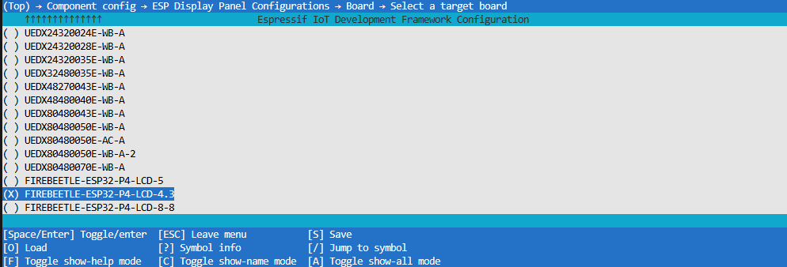
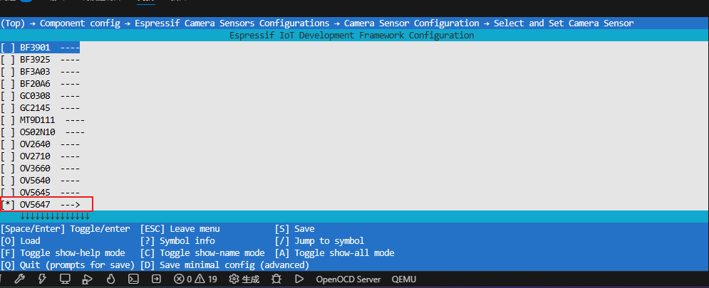
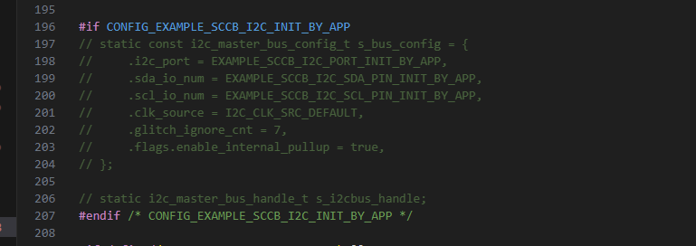
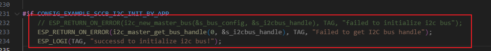
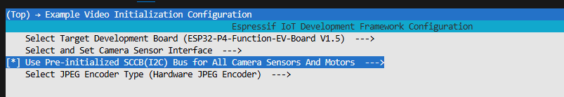

1、选择开发板

2、选择摄像头

3、修改摄像头相关配置
屏蔽

#if CONFIG_EXAMPLE_SCCB_I2C_INIT_BY_APP
    // ESP_RETURN_ON_ERROR(i2c_new_master_bus(&s_bus_config, &s_i2cbus_handle), TAG, "failed to initialize i2c bus");
    ESP_RETURN_ON_ERROR(i2c_master_get_bus_handle(0, &s_i2cbus_handle), TAG, "Failed to get I2C bus handle");
    ESP_LOGI(TAG, "successd to initialize i2c bus!");

修改